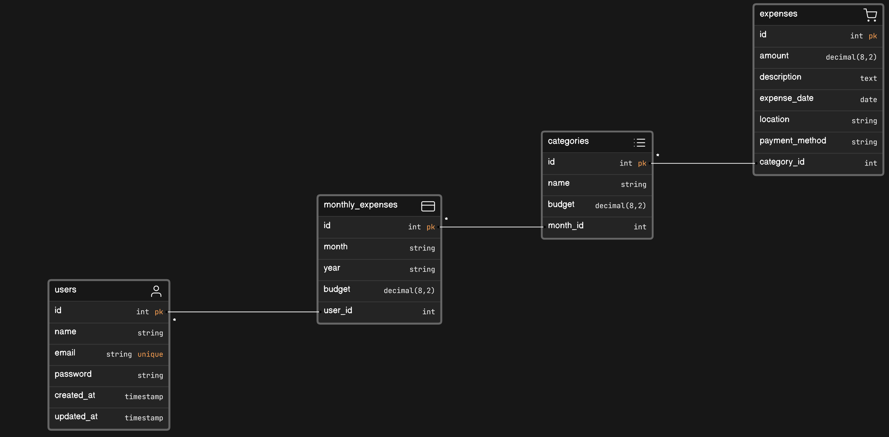

<p align="center"><a href="https://laravel.com" target="_blank"></a></p>

# Expense Tracker
You need to create a daily expense tracker that helps users manage their expenses effectively. It should allow users to input expenses, categorize them, set budgets, and gain insights into their spending habits.

Here's what the system should do:

- Expense Entry: Create a flexible Expense class with attributes like id, amount, category, description, date, payment method, and location.

- Expense Categories: Let users choose from preset expense categories and add custom ones. They should be able to set budgets for each category and get alerts when nearing or exceeding these limits.

- Dashboard: Show users their remaining budget, total expenses, and a summary of expenses by category.

- Budget Tracking: Allow users to set monthly budgets for overall spending and individual categories. Show a summary of the budget and track spending against it. Users should be able to adjust budgets as needed.

Here are some example use cases:

Users get a notification if they overspend on entertainment after adding a $40 monthly streaming subscription.
Users set a $300 monthly budget and can adjust category budgets based on their financial priorities.

## ERD


# Follow the following steps
1. Create a new Laravel project.
    ```
    composer create-project laravel/laravel expense-tracker

    cd weather-app-api
    ```

2. Open in Visual Studio Code and run the project.

    ```
   php artisan serve
    ```

3. To create `users`, `monthly_expenses`, `categories`, and `expenses` tables, we will generate database migration files using the following commands
    
    ```
    php artisan make:migration create_users_table
    php artisan make:migration create_monthly_expenses_table
    php artisan make:migration create_categories_table 
    php artisan make:migration create_expenses_table
    ```
    and a new file under the `database/migrations` directory will be created. In this file, we will add necessary column fields according to our ERD. 
    
4. Turn on the `MYSQL` server on XAMPP. 
    Setup your database configurations on `.env` file. E.g. MYSQL port is 3306, and database name is `expense_tracker_db` in this case.
    ```
    DB_CONNECTION=mysql
    DB_HOST=127.0.0.1
    DB_PORT=3306
    DB_DATABASE=expense_tracker_db
    DB_USERNAME=root
    DB_PASSWORD=
    ```
    Finally, run the migration by executing following command,
    ```
    php artisan migrate
    ```
    You can check the database on phpMyAdmin by running the Apache server and going to the admin panel.

    If you want to check how many migrations you have ran so far, run the following command
    ```
    php artisan migrate:status
    ```
5. Create controllers `UserController`, `MonthlyExpenseController`, `CategoryController`, and `ExpenseController` and implement database queries for CRUD and other necessary operations using [Query Builder](https://laravel.com/docs/10.x/queries).

6. Add these methods as routes (e.g. we will use `api.php`).

7. Now use `Postman` to perform API calls, and check the outputs. E.g. `http://127.0.0.1:8000/api/...`

8. You can generate fake data using [seeders](https://laravel.com/docs/10.x/seeding). To create a new seeder use the command,
    ```
    php artisan make:seeder DatabaseSeeder
    ```
    Then to run,
    ```
    php artisan db:seed
    ```
    You may also seed your database using the migrate:fresh command in combination with the --seed option, which will drop all tables and re-run all of your migrations. 
    ```
    php artisan migrate:fresh --seed
    ```

## Running the project
1. Clone the project and change the directory
```
git clone https://github.com/FarhanSadaf/CSE3100-Web-Programming-Lab.git lab-10/expense-tracker

cd lab-10/expense-tracker
```
2. Install the dependencies
```
composer install
```
3. Copy `.env.example` to `.env`
```
cp .env.example .env
```
4. Generate application key 
```
php artisan key:generate
```
5. Start the web server
```
php artisan serve
```


## Tasks
1. Write methods in the controllers to find **Total Remaining Expense of a User for a Month**, **Filter Expenses of a User by Data Range**.
2. Modify the `store` and `update` method in `ExpensesController` so that if adding this expense makes monthly budget exceed, it will send a error message in the response.
3. Try implementing the Views. E.g. signup and signin, a dashboard displaying budget summaries and monthly expenses with navigation to previous months, and a detailed report page allowing users to filter expenses by date range and category, with an export option for CSV or Excel files.