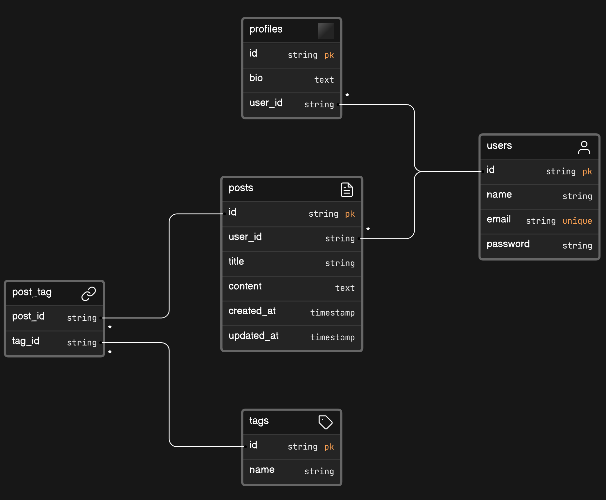

<p align="center"><a href="https://laravel.com" target="_blank"></a></p>


# Social App using Eloquent ORM



- One-to-One Relationship (1:1): `users` and `profiles`
- One-to-Many Relationship (1:M): `users` and `posts`
- Many-to-Many Relationship (M:M): `posts` and `tags`, where `post_tag` acts as a pivot table connecting them

## Building from the scratch
1. Create a new project, open project in any code editor. Delete previous migration files.
2. We will use MySQL for database connection in this project. Hence, open XAMPP control panel and start the MySQL server. 
3. Run `php artisan make:session-table` command, to avoid any unexpected errors.
4. Configure your database connection in `.env` file. Add your preferred database name in `DB_DATABASE` variable.
```
DB_CONNECTION=mysql
DB_HOST=127.0.0.1
DB_PORT=3306
DB_DATABASE=social_app_orm
DB_USERNAME=root
DB_PASSWORD=
```
5. Now make migration files for `users`, `profiles`, `posts`, `tags`, and `post_tag` table. 
```
php artisan make:migration create_users_table
php artisan make:migration create_profiles_table
php artisan make:migration create_posts_table
php artisan make:migration create_tags_table
php artisan make:migration create_post_tag_table
```
Then, add respective columns.

6. Run the migration using the following command
```
php artisan migrate
```
7. You can find the database in PHPMyAdmin panel (`social_app_orm` in this case). 
8. You can add some dummy data from the sql file provided in `public/insert_queries`. Or you can run the seeder, in which we have inserted some dummy data using Query Builder in `database/seeders/DatabaseSeeder.php` file.
To run the seeder,
```
php artisan migrate --seed
```
Or if you want to refresh the database (drop all the tables then run migration again),
```
php artisan migrate:fresh --seed
```
9. The CRUD operation is demonstrated in this project using Eloquent ORM. You can find the routes in `web.php` file.

10. Create models for `User`, `Profile`, `Post`, and `Tag`. N.b. delete pre-defined models before creating new ones.
```
php artisan make:model User
php artisan make:model Profile
php artisan make:model Post
php artisan make:model Tag
```
Remember that, model names must be singular and table names should be in plural. For example,
<table>
<tr>
<th> Table name </th>
<th> Model name </th>
</tr>
<tr>
<td> users </td>
<td> User </td>
</tr>
<tr>
<td> profiles </td>
<td> Profile </td>
</tr>
<tr>
<td> posts </td>
<td> Post </td>
</tr>
<tr>
<td> tags </td>
<td> Tag </td>
</tr>
</table>

And for the M:M relationship, the pivot table name should be in singular form, joined by underscore. E.g. `post_tag` for `Post` and `Tag` models.

11. Add necessary 1:1 `hasOne() : belongsTo()`, 1:M `hasMany() : belongsTo()`, M:M `belongsToMany() : belongsToMany()` functions in the models to link the relations.


## Quickstart the project
1. Clone the project and change the directory
```
git clone https://github.com/FarhanSadaf/CSE3100-Web-Programming-Lab.git lab-9/social-app-orm

cd lab-9/social-app-orm
```
2. Install the dependencies
```
composer install
```
3. Copy `.env.example` to `.env`
```
cp .env.example .env
```
4. Generate application key 
```
php artisan key:generate
```
5. Start the web server
```
php artisan serve
```

## References
1. https://laravel.com/docs/10.x/eloquent
2. https://laravel.com/docs/10.x/migrations
3. https://laravel.com/docs/10.x/seeding
