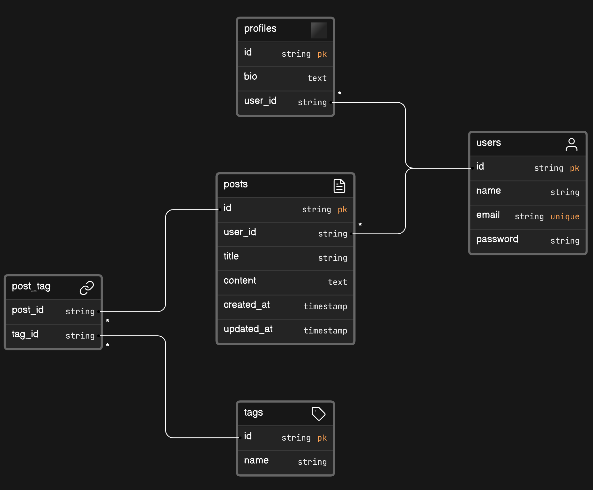

<p align="center"><a href="https://laravel.com" target="_blank"></a></p>


# Social App using Query Builder



- One-to-One Relationship (1:1): `users` and `profiles`
- One-to-Many Relationship (1:M): `users` and `posts`
- Many-to-Many Relationship (M:M): `posts` and `tags`, where `post_tag` acts as a pivot table connecting them

## Building from the scratch
1. Create a new project, open project in any code editor. Delete previous migration files.
2. We will use MySQL for database connection in this project. Hence, open XAMPP control panel and start the MySQL server. 
3. Run `php artisan make:session-table` command, to avoid any unexpected errors.
4. Configure your database connection in `.env` file. Add your preferred database name in `DB_DATABASE` variable.
```
DB_CONNECTION=mysql
DB_HOST=127.0.0.1
DB_PORT=3306
DB_DATABASE=social_app_qb
DB_USERNAME=root
DB_PASSWORD=
```
5. Now make migration files for `users`, `profiles`, `posts`, `tags`, and `post_tag` table. 
```
php artisan make:migration create_users_table
php artisan make:migration create_profiles_table
php artisan make:migration create_posts_table
php artisan make:migration create_tags_table
php artisan make:migration create_post_tag_table
```
Then, add respective columns.

6. Run the migration using the following command
```
php artisan migrate
```
7. You can find the database in PHPMyAdmin panel (`social_app_qb` in this case). 
8. You can add some dummy data from the sql file provided in `public/insert_queries`. Or you can run the seeder, in which we have inserted some dummy data using Query Builder in `database/seeders/DatabaseSeeder.php` file.
To run the seeder,
```
php artisan migrate --seed
```
Or if you want to refresh the database (drop all the tables then run migration again),
```
php artisan migrate:fresh --seed
```
9. Finally, the CRUD operation is demonstrated in this project using Laravel Query Builder. You can find the routes in `web.php` file.

## Quickstart the project
1. Clone the project and change the directory
```
git clone https://github.com/FarhanSadaf/CSE3100-Web-Programming-Lab.git lab-9/social-app-qb

cd lab-9/social-app-qb
```
2. Install the dependencies
```
composer install
```
3. Copy `.env.example` to `.env`
```
cp .env.example .env
```
4. Generate application key 
```
php artisan key:generate
```
5. Start the web server
```
php artisan serve
```

## References
1. https://laravel.com/docs/10.x/queries
2. https://laravel.com/docs/10.x/migrations
3. https://laravel.com/docs/10.x/seeding
