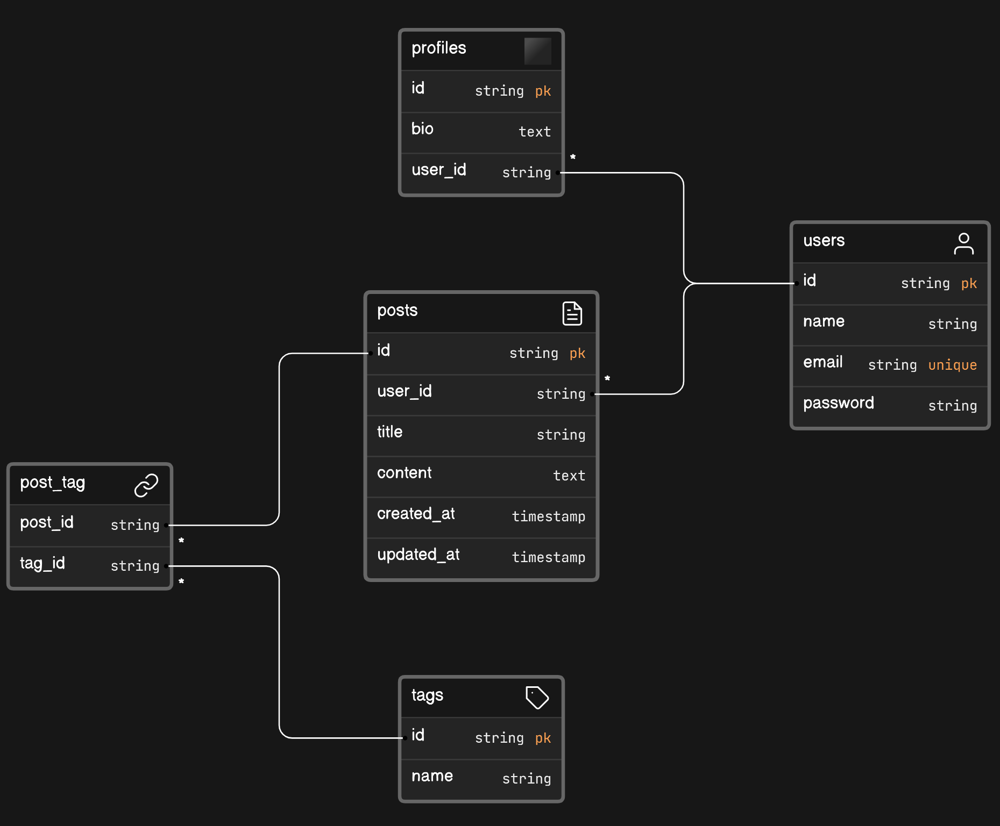

<p align="center"><a href="https://laravel.com" target="_blank"></a></p>


# Social App



- One-to-One Relationship (1:1): `users` and `profiles`
- One-to-Many Relationship (1:M): `users` and `posts`
- Many-to-Many Relationship (M:M): `posts` and `tags`, where `post_tag` acts as a pivot table connecting them

## Building from the scratch
1. Create a new project, open project in any code editor. Delete previous migration files.
2. We will use MySQL for database connection in this project. Hence, open XAMPP control panel and start the MySQL server. 
3. Run `php artisan make:session-table` command, to avoid any unexpected errors.
4. Configure your database connection in `.env` file. Add your preferred database name in `DB_DATABASE` variable.
```
DB_CONNECTION=mysql
DB_HOST=127.0.0.1
DB_PORT=3306
DB_DATABASE=social_app_db
DB_USERNAME=root
DB_PASSWORD=
```
5. Now make migration files for `users`, `profiles`, `posts`, `tags`, and `post_tag` table. 
```
php artisan make:migration create_users_table
php artisan make:migration create_profiles_table
php artisan make:migration create_posts_table
php artisan make:migration create_tags_table
php artisan make:migration create_post_tag_table
```
Then, add respective columns.

6. Run the migration using the following command
```
php artisan migrate
```
Or if you want to fresh the database (drop all the tables then run migration again),
```
php artisan migrate:fresh
```
7. You can find the database in PHPMyAdmin panel (`social_app_db` in this case). 
8. You can add some dummy data from the sql file provided in `public/insert_queries`. Or you can run the seeder, in which we have inserted some dummy data using Query Builder in `database/seeders/DatabaseSeeder.php` file.
To run the seeder,
```
php artisan migrate --seed
```
Or if you want to fresh the database with the seed,
```
php artisan migrate:fresh --seed
```
9. For the next stages, database CRUD operations are demonstrated using both Query Builder and Eloquent ORM. You can find the routes in `web.php` file.
    
    ### Query Builder
    #### Task 1
    a. In the controller `QBExerciseController`, the CRUD operation was demonstrated using Query Builder for the table `users`. Associated routes are,
    - GET `/qb/user/` : To read all the users.
    - GET `/qb/user/create` : To create a new user.
    - GET `/qb/user/update/{id}` : To update a user with id.
    - GET `/qb/user/delete/{id}` : To delete a user with id.

    #### Task 2
    b. In the controller `PostControllerQB`, the CRUD operation was demonstrated using Query Builder for the table `posts`. Associated routes are,
    - GET `/qb/post/{userId}/` : To read all the posts of the user with id (userId).
    - GET `/qb/post/{userId}/create` : To create a new post for the user with id (userId).
    - POST `/qb/post/{userId}/create` : To create a new post for the user with id (userId).
    - GET `/qb/post/{userId}/update/{postId}` : To update a post with id (postId) for the user with id (userId).
    - POST `/qb/post/{userId}/update/{postId}` : To update a post with id (postId) for the user with id (userId).
    - GET `/qb/post/{userId}/delete/{postId}` : To delete a post with id (postId) for the user with id (userId).

    ### Eloquent ORM
    i. Create models for `User`, `Profile`, `Post`, and `Tag`. N.b. delete pre-defined models before creating new ones.
    ```
    php artisan make:model User
    php artisan make:model Profile
    php artisan make:model Post
    php artisan make:model Tag
    ```
    Remember that, model names must be singular and table names should be in plural. For example,
    <table>
    <tr>
    <th> Table name </th>
    <th> Model name </th>
    </tr>
    <tr>
    <td> users </td>
    <td> User </td>
    </tr>
    <tr>
    <td> profiles </td>
    <td> Profile </td>
    </tr>
    <tr>
    <td> posts </td>
    <td> Post </td>
    </tr>
    <tr>
    <td> tags </td>
    <td> Tag </td>
    </tr>
    </table>

    And for the M:M relationship, the pivot table name should be in singular form, joined by underscore. E.g. `post_tag` for `Post` and `Tag` models.

    ii. Add necessary 1:1 `hasOne() : belongsTo()`, 1:M `hasMany() : belongsTo()`, M:M `belongsToMany() : belongsToMany()` functions in the models to link the relations.

    #### Task 1
    a. In the controller `ORMExerciseController`, the CRUD operation was demonstrated using Eloquent ORM for the table `users`. Associated routes are,
    - GET `/orm/user/` : To read all the users.
    - GET `/orm/user/create` : To create a new user.
    - GET `/orm/user/update/{id}` : To update a user with id.
    - GET `/orm/user/delete/{id}` : To delete a user with id.

    #### Task 2
    b. In the controller `PostControllerORM`, the CRUD operation was demonstrated using Eloquent ORM for the table `posts`. Associated routes are,
    - GET `/orm/post/{userId}/` : To read all the posts of the user with id (userId).
    - GET `/orm/post/{userId}/create` : To create a new post for the user with id (userId).
    - POST `/orm/post/{userId}/create` : To create a new post for the user with id (userId).
    - GET `/orm/post/{userId}/update/{postId}` : To update a post with id (postId) for the user with id (userId).
    - POST `/orm/post/{userId}/update/{postId}` : To update a post with id (postId) for the user with id (userId).
    - GET `/orm/post/{userId}/delete/{postId}` : To delete a post with id (postId) for the user with id (userId).


## Quickstart the project
1. Clone the project and change the directory
```
git clone https://github.com/FarhanSadaf/CSE3100-Web-Programming-Lab.git lab-9/social-app

cd lab-9/social-app
```
2. Install the dependencies
```
composer install
```
3. Copy `.env.example` to `.env`
```
cp .env.example .env
```
4. Generate application key 
```
php artisan key:generate
```
5. Configure your database connection in `.env` file. Add your preferred database name in `DB_DATABASE` variable.
```
DB_CONNECTION=mysql
DB_HOST=127.0.0.1
DB_PORT=3306
DB_DATABASE=social_app_db
DB_USERNAME=root
DB_PASSWORD=
```
6. Start XAMPP Control Panel and start the MySQL server.
7. Run the migration with seeders
```
php artisan migrate --seed
```
8. Start the web server
```
php artisan serve
```

## References
1. https://laravel.com/docs/11.x/queries
2. https://laravel.com/docs/11.x/eloquent
3. https://laravel.com/docs/11.x/migrations
4. https://laravel.com/docs/11.x/seeding

## Tasks
1. Implement an authentication system, where a user can register (create an instance on `users` and `profiles` table, [hash](https://laravel.com/docs/11.x/hashing) the password before saving it to the database) and login to the app using email and password.
2. After login, user can update their profile bio (on `profiles` table).
3. User can create new tags, update or delete previous tags (on `tags` table).
4. User can create a new post, update or delete old posts (on `posts` table), and posts will be ordered by the created_at column.

    [N.b. you can use [session](https://laravel.com/docs/11.x/session) to store the current user_id while navigating through different routes. Make sure to delete the session when user decides to logout.] 