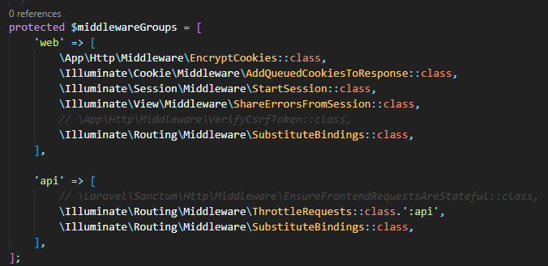
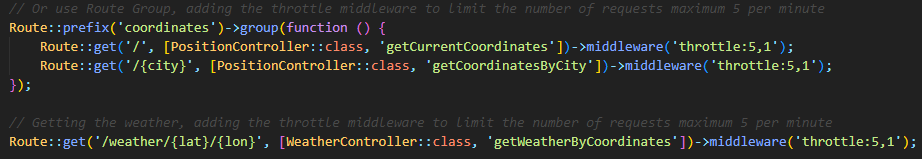
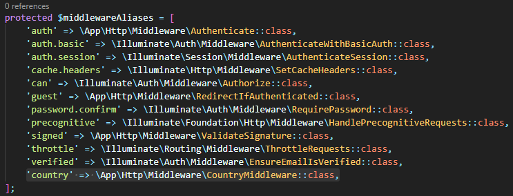
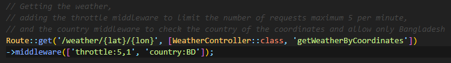

<p align="center"><a href="https://laravel.com" target="_blank"></a></p>

# Creating a Weather Application
In this lab, we will create basic a weather SPA (Single Page Application) using API calls which will show the weather of only the specified country.


# Follow the following steps
1. Create a new Laravel project.
    ```
    composer create-project laravel/laravel weather-app-api

    cd weather-app-api
    ```

2. Open in Visual Studio Code and run the project.

    ```
   php artisan serve
    ```

4. Installing [Guzzle](https://github.com/guzzle/guzzle) (for client HTTP API)

    ```
   composer require guzzlehttp/guzzle
    ```

    If you get any errors while running this command, try running `composer update` first and then the above command.

4. As we will use [OpenWeather](openweathermap.org) for API calls, create a new account there and get your [API KEY](https://home.openweathermap.org/api_keys).

5. Add your API key to `.env` file. E.g.

    `OPENWEATHER_API_KEY="fdcc5af3e2fdb3774b4cf41008dffc6"`

6. Getting the coordinates
    1) Create a new controller by writing this command, `php artisan make:controller PositionController`.
    2) Implemement `getCurrentCoordinates()` function on `PositionContoller` to fetch the current co-ordinate information of the user using the [IP Geolocation API](https://ip-api.com/). 
    3) Implemement `getCoordinatesByCity($city)` function on `PositionContoller` to fetch the co-ordinate information by city name using the [Direct Geocoding API](https://openweathermap.org/api/geocoding-api). 
    4) Add the routes on `web.php`. If you test the routes using `Postman` and don't get any response, make sure to comment `\App\Http\Middleware\VerifyCsrfToken::class` of `$middlewareGroups` in `\App\Http\Kernel.php`.
    

7. Getting the weather
    1) Create a new controller by writing this command, `php artisan make:controller WeatherController`.
    2) Implemement `getWeatherByCoordinates($lat, $lon)` function on `WeatherController` to fetch the current weather with co-ordinate information using the [OpenWeather API](https://openweathermap.org/current). 

8. (Optional) We can use throttle middleware to restrict the traffic for a given route or group of routes. In this case, we have added the throttle middleware in `\coordinates`, `\coordinates\{city}`, `\weather\lat\lon` routes to limit the number of requests to a maximum of 5 per minute.


9. To restrict the route calls only from the specified country, we will add another middleware which will restrict the calls.
    1) Create a new middleware by writing this command, `php artisan make:middleware CountryMiddleware`.
    2) Implement the `handle` function, which uses the [Reverse Geocoding API](https://openweathermap.org/api/geocoding-api) to determine if a `lat` and `lon` is within the country passed in the parameter.
    3) We can use a middleware alias by adding the `\App\Http\Middleware\CountryMiddleware::class` in the `$$middlewareAliases` variable of `\App\Http\Kernel.php`.
    
    4) Finally, add the middleware in `\weather\{lat}\{lon}` route along with the country code. E.g. we have used BD in our case.
    

10. Create a new view using the `php artisan make:view weather` command.

    A new view file, `\resources\views\weather.blade.php` will be created.

11. Design the `weather.blade.php` file as you like. In this project, we created `css` and `js` folders in `public` directory and put all the CSS and JS files there.

12. In the JS file, we used fetch API to call routes `/coordinates/{city}` and `/weather/{lat}/{lon}` and set the weather contents on the HTML file.


## Running the project
1. Clone the project and change the directory
```
git clone https://github.com/FarhanSadaf/CSE3100-Web-Programming-Lab.git lab-9/weather-app-api

cd lab-9/weather-app-api
```
2. Install the dependencies
```
composer install
```
3. Copy `.env.example` to `.env`
```
cp .env.example .env
```
4. Generate application key 
```
php artisan key:generate
```
5. Start the web server
```
php artisan serve
```


## Tasks
1. Create a function `getCurrentWeather()` in `WeatherController` and add a route `\weather`, which will fetch the weather of client's current location without providing any latitude and longitude. Use `getCurrentCoordinates()` function from `PositionController` class to implement `getCurrentWeather()` function.
2. Remove the `CountryMiddleware` from `\weather\lat\lon` route, and create another middleware called `ClientCountryMiddleware`, and implement the `handle` function so that the client can search for city weather of any country but only if the client is located in the specified country. E.g. adding `middleware('clientCountry:BD')` will allow the users from Bangladesh to look for the weather. Check if your middleware worked by changing your country using a VPN.
3. Update the design of the front end. Get creative! E.g. show more weather information, add images/logos which will change based on the weather description, etc. You can use any CSS/JS framework. 

## References
1. https://github.com/rakibdevs/openweather-laravel-api/tree/master
